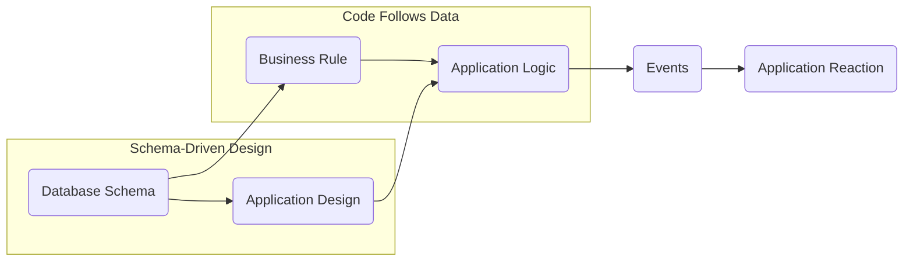

In the ever-evolving landscape of software development, new architectures emerge promising agile adaptation and robust performance. One such approach gaining traction is Database-Driven Development (DDD), where the database takes center stage, dictating the application's structure and behavior. Let's dive into the concept, explore its advantages and drawbacks, and compare it to some alternatives.

### Core Principles of DDD

DDD revolves around five fundamental pillars:

1\. Data is the Source of Truth: The database serves as the single, canonical source of all application data, ensuring consistency and eliminating data redundancy.

2\. Schema-Driven Design: The database schema directly drives the application design. Tables become models, columns become attributes, and relationships between tables are mapped to relationships between models.

3\. Code Follows Data: Application logic resides in business rules and stored procedures within the database, rather than scattered throughout the application code.

4\. Event-Driven Programming: Changes in the database trigger events that the application reacts to, promoting loosely coupled components and asynchronous communication.

5\. Declarative Programming: Business logic is expressed in declarative statements within the database, freeing developers from the complexities of imperative coding.

### Mermaid Diagram: Conceptualizing DDD

### Advantages of DDD

* Enhanced Data Integrity: Centralized data management reduces redundancy and inconsistencies, fostering data trust and reliability.
    
* Increased Developer Productivity: Schema-driven development simplifies coding and reduces time spent on data access logic.
    
* Scalability and Flexibility: Event-driven architecture facilitates decoupled components, enabling easier scaling and adaptations to changing data models.
    
* Improved Maintainability: Code concentrated in business rules within the database simplifies code comprehension and modification.
    
* Robust Performance: Leveraging database capabilities for data manipulation can optimize performance and resource utilization.
    

### Drawbacks of DDD

* Steeper Learning Curve: Developers need to master database-specific languages and techniques, presenting an initial learning hurdle.
    
* Limited Code Reuse: Application logic resides in the database, making sharing or reusing code across applications less straightforward.
    
* Testing Challenges: Testing database logic can be more intricate than traditional unit testing, requiring specialized tools and strategies.
    
* Debugging Difficulties: Debugging code within the database can be more challenging than debugging traditional application code.
    
* Vendor Lock-in: Tight coupling to specific database platforms can hinder portability and limit future flexibility.
    

### Alternatives to DDD

* Model-View-Controller (MVC): A widely used architecture separating business logic (model), presentation layer (view), and user interaction (controller). Offers clear separation of concerns but can lead to data duplication and complex data access logic.
    
* Microservices: An architecture based on independent, interconnected services for improved scalability and agility. However, it can introduce challenges in data consistency and overall system complexity.
    
* Serverless Architecture: A cloud-based model where developers focus on code execution without managing servers. Can be beneficial for cost and maintenance but relies on vendor platforms and may have latency concerns.
    

### Choosing the Right Architecture

The ideal architecture depends on your specific project requirements, team expertise, and long-term vision. DDD's data-centric approach is particularly beneficial for data-intensive applications, while more traditional architectures may be better suited for simpler projects or teams less familiar with database complexities.

Ultimately, a thorough evaluation of each approach and its implications is crucial to making an informed decision that fosters optimal development, performance, and future flexibility.