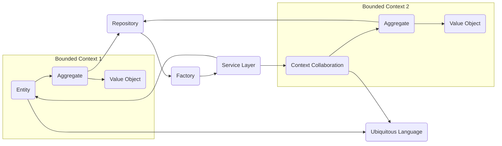

In the bustling realm of software development, where methodologies vie for supremacy, Domain-Driven Development (DDD) stands out for its deep reverence for the "domain" itself. Unlike Database-Driven Development (DDD's close cousin), which elevates the database to the throne, DDD prioritizes capturing the intricate nuances and complexities of the application's core domain. Let's embark on a journey to understand this fascinating approach, explore its strengths and weaknesses, and compare it to other architectural contenders.

### Unpacking the DDD Toolbox

DDD equips developers with a powerful arsenal of tools to tame the domain beast:

1\. Ubiquitous Language: A shared vocabulary encompassing all domain concepts, fostering clear communication and reducing semantic ambiguity.

2\. Bounded Contexts: Well-defined partitions of the domain, each with its own model and responsibility, promoting modularity and focused development.

3\. Building Blocks: Domain-centric elements like entities, aggregates, and value objects encapsulate the essence of the domain, guiding design and implementation.

4\. Strategic Design Patterns: Proven patterns like Repository, Factory, and Service Layer orchestrate interactions within and between bounded contexts, ensuring cohesion and maintainability.

5\. Continuous Evolution: DDD is an iterative process, adapting to evolving domain understanding through constant refactoring and model adjustments.

### Mermaid Diagram: Decoding DDD's Inner Workings

### Advantages of DDD

* Enhanced Domain Expertise: Focus on the domain fosters a deeper understanding of its intricacies, leading to more accurate and robust solutions.
    
* Improved Communication: Ubiquitous language bridges the gap between developers and domain experts, facilitating collaboration and reducing misinterpretations.
    
* Modular and Maintainable Code: Bounded contexts promote isolation and encapsulation, simplifying code management and updates.
    
* Scalability and Adaptability: Evolving models and patterns support changing domain requirements and facilitate future modifications.
    
* Reduced Complexity: Strategic design patterns tame the chaos of complex domains, ensuring clarity and organization.
    

### Drawbacks of DDD

* Steeper Learning Curve: Mastering DDD concepts and patterns requires significant investment in learning and practice.
    
* Over-engineering Risk: The allure of intricate modeling can lead to over-engineering and unnecessary complexity.
    
* Potential Overcommunication: Effective communication becomes crucial within and across bounded contexts, demanding additional time and effort.
    
* Immature Tooling: DDD tools and frameworks are still evolving, potentially necessitating custom solutions or workarounds.
    
* Potential for Misinterpretation: Domain experts might misunderstand technical implementation details, leading to confusion and rework.
    

### Alternatives to DDD

* Layered Architecture: Separates presentation, business logic, and data access layers, fostering clarity and maintainability. However, it can lead to complex dependency chains and boilerplate code.
    
* Clean Architecture: Similar to layered architecture, but emphasizes abstraction and decoupling, promoting testability and adaptability. Requires meticulous planning and discipline to avoid code duplication.
    
* Hexagonal Architecture: Another decoupling-focused approach, placing the application core at the center surrounded by independent "ports" for UI, databases, etc. Can be less intuitive and require stronger upfront design.
    

### Concluding Thoughts

DDD, like any architecture, shines in some contexts and fades in others. Its domain-centric focus offers unmatched precision and understanding, but it demands meticulous attention to detail and a mature development team. Consider your project's complexity, team expertise, and future vision before venturing into the fascinating world of DDD. And remember, as with DDD's cousin Database-Driven Development (discussed in a [previous article](https://thediligentengineer.com/database-driven-development-architecture-putting-data-at-the-helm)), choosing the right architecture is a delicate dance, requiring careful evaluation and thoughtful execution.

By equipping yourself with knowledge and weighing the pros and cons, you can confidently chart your course through the architectural landscape, building software that not only functions, but truly embodies the very essence of your domain.