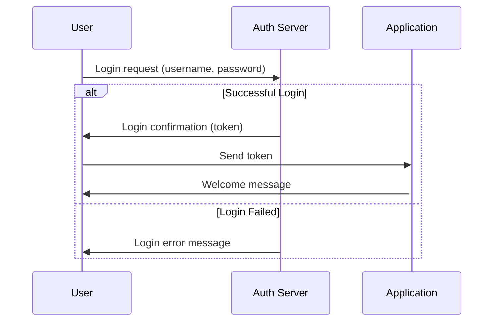

Software development needs clarity. Architects map out functionalities, and developers navigate complex interactions. Enter Mermaid JS, a lightweight diagramming language that weaves magic within text documents. Today, we'll explore its use case diagrams and sequence diagrams -- vital tools for architects and developers alike.

Mermaid in a Nutshell:

Imagine crafting diagrams embedded within Markdown or code! No clunky software, just concise text definitions that magically transform into elegant visuals. Markdown-inspired syntax makes learning a breeze, even for Mermaid newbies.

Why Use Cases and Sequences?

Use case diagrams:

-   Visualize functionalities: Map actors (users, systems) and their interactions with your software.
-   Prioritize development: Quickly identify core functionalities and tackle them first.
-   Improve communication: Enhance discussions between architects, developers, and stakeholders.

Sequence diagrams:

-   Model interactions: Diagram the messages exchanged between components in specific scenarios.
-   Identify complexities: Uncover potential bottlenecks or race conditions early on.
-   Document system behavior: Provide a reliable reference point for developers and maintainers.

Mermaid Makes These Diagrams Sing:

Example 1: Online Store Use Case Diagram (Mermaid code):


```mermaid
usecase diagram
Customer -> Online Store: Browse Products
Online Store -> Customer: Show Product Details
Customer -> Online Store: Add Product to Cart
Customer -> Online Store: Checkout
Online Store -> Payment Gateway: Process Payment
Online Store -> Warehouse: Ship Order
Online Store -> Customer: Send Order Confirmation

```


Example 2: Login Sequence Diagram (Mermaid code):




Beyond the Basics:

Mermaid packs a punch! You can:

-   Style your diagrams: Customize colors, fonts, and shapes to match your brand.
-   Annotate elements: Add notes and explanations for increased clarity.
-   Generate interactive diagrams: Clickable elements for dynamic exploration.

Mermaid's charm lies in its simplicity and power. It seamlessly integrates into your existing workflow, boosting communication and understanding within your team. So, dive into the depths of Mermaid JS and tame the Kraken of complex software requirements with elegant diagrams!

Remember: This is just a glimpse into Mermaid's vast potential. Explore its documentation and dive deeper into its features to unleash its full power in your software development process.

Happy diagramming!