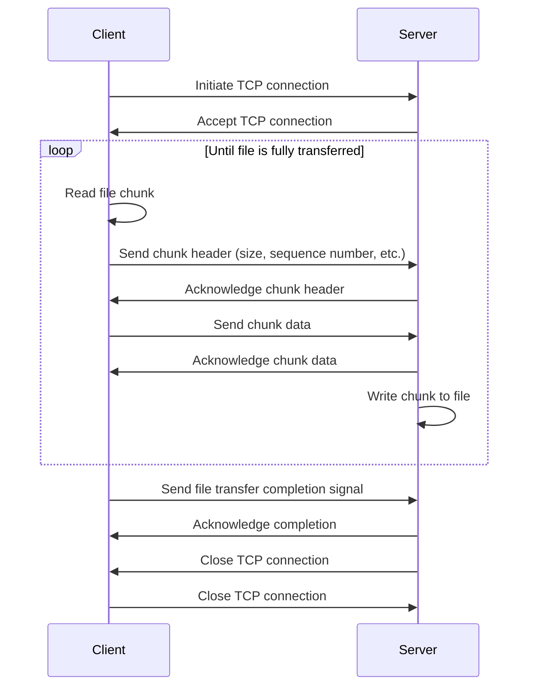

When dealing with large files in development, the traditional approach of reading the entire file into memory can lead to memory-related issues. To overcome this challenge, streaming becomes a crucial concept. Streaming involves sending files in smaller, manageable chunks rather than all at once. In this article, we will explore how to implement a file server in Golang that can efficiently stream large files over TCP connections.


## Setting the Stage

Let's begin by understanding the importance of streaming and the pitfalls of loading large files into memory. Loading large files at once can lead to memory exhaustion, especially in scenarios where the file size exceeds available system resources.

## Building a Simple File Server

To implement a file server in Golang, we'll leverage the net package for handling network connections and the io package for reading and writing data. Additionally, we'll use a buffer to efficiently store and manage the streaming data.

```go
// File Server

// Listen for incoming connections
listener, err := net.Listen("tcp", ":8080")
if err != nil {
    log.Fatal(err)
}

for {
    // Accept connection
    conn, err := listener.Accept()
    if err != nil {
        log.Fatal(err)
    }

    // Handle connection concurrently
    go handleConnection(conn)
}

// Handle Connection
func handleConnection(conn net.Conn) {
    defer conn.Close()

    // Open the file
    file, err := os.Open("largefile.dat")
    if err != nil {
        log.Fatal(err)
    }
    defer file.Close()

    // Create a buffer for streaming
    buffer := make([]byte, 1024)

    // Read and stream file data
    for {
        bytesRead, err := file.Read(buffer)
        if err == io.EOF {
            break
        }
        conn.Write(buffer[:bytesRead])
    }
}
```

## Implementing the Client

Now that we have our file server, let's create a client program that sends a file to the server. We'll use the net and io packages, along with a buffer for efficient data transfer.

```go
// File Client

// Dial the server
conn, err := net.Dial("tcp", "localhost:8080")
if err != nil {
    log.Fatal(err)
}
defer conn.Close()

// Open the file to be sent
file, err := os.Open("largefile.dat")
if err != nil {
    log.Fatal(err)
}
defer file.Close()

// Create a buffer for streaming
buffer := make([]byte, 1024)

// Read and send file data
for {
    bytesRead, err := file.Read(buffer)
    if err == io.EOF {
        break
    }
    conn.Write(buffer[:bytesRead])
}
```

## Handling Unknown File Sizes

A common challenge in file streaming is not knowing the size of the file in advance. To address this, we can send the file size as part of the data, allowing the server to anticipate the incoming data and allocate resources accordingly.

```go
// Sending File Size

// Get file size
fileInfo, err := file.Stat()
if err != nil {
    log.Fatal(err)
}

// Convert file size to bytes
fileSize := make([]byte, 8)
binary.BigEndian.PutUint64(fileSize, uint64(fileInfo.Size()))

// Send file size to the server
conn.Write(fileSize)
```

## Reading File Size on the Server Side

On the server side, we need to read the file size from the incoming data to allocate the necessary resources.

```go
// Reading File Size on Server Side

// Create a buffer for receiving file size
fileSizeBuffer := make([]byte, 8)

// Read file size from the client
_, err := conn.Read(fileSizeBuffer)
if err != nil {
    log.Fatal(err)
}

// Convert bytes to uint64
fileSize := binary.BigEndian.Uint64(fileSizeBuffer)
```

## Bringing It All Together

To complete the process, we can now integrate the techniques discussed to stream a large file. This involves sending the file size and subsequently streaming the data in manageable chunks.

```go
// Streaming a Large File

// ... (Previous code for setting up connection and handling file)

// Send file size to the server
conn.Write(fileSize)

// Read and stream file data
for {
    bytesRead, err := file.Read(buffer)
    if err == io.EOF {
        break
    }
    conn.Write(buffer[:bytesRead])
}
```

Sequence diagram



>
1.  Initiate TCP connection: The client starts the process by establishing a TCP connection with the server.
2.  Accept TCP connection: The server accepts the incoming connection request from the client.
3.  Read file chunk: The client reads a portion of the file into a buffer (chunk).
4.  Send chunk header: The client sends information about the chunk (size, sequence number, etc.) to the server.
5.  Acknowledge chunk header: The server confirms receipt of the chunk header.
6.  Send chunk data: The client sends the actual chunk data to the server.
7.  Acknowledge chunk data: The server confirms receipt of the chunk data.
8.  Write chunk to file: The server writes the received chunk to the destination file.
9.  Loop until completion: Steps 3-8 repeat until the entire file has been transferred.
10. Send completion signal: The client sends a signal to the server indicating that the file transfer is complete.
11. Acknowledge completion: The server acknowledges the completion signal.
12. Close TCP connection: Both the client and server close the TCP connection.

### Key Points:

-   Chunking: The file is divided into smaller chunks for efficient transmission and potential retransmission if errors occur.
-   Headers: Chunk headers contain metadata about the chunk, such as its size and sequence number, for proper reassembly at the server.
-   Acknowledgments: Server acknowledgments ensure reliable transfer and allow for retransmission if necessary.
-   Completion signal: The completion signal marks the end of the file transfer process.
-   TCP connection management: The TCP connection is established, maintained, and closed to ensure reliable data transfer.

## Conclusion

In this article, we explored the challenges associated with handling large files in Golang and demonstrated how to implement a file server capable of streaming files over TCP connections. Leveraging the net and io packages, along with effective buffer usage, ensures efficient and reliable large file transfers. By including the file size as part of the data, we address the issue of not knowing the file size in advance, enabling seamless and secure streaming.