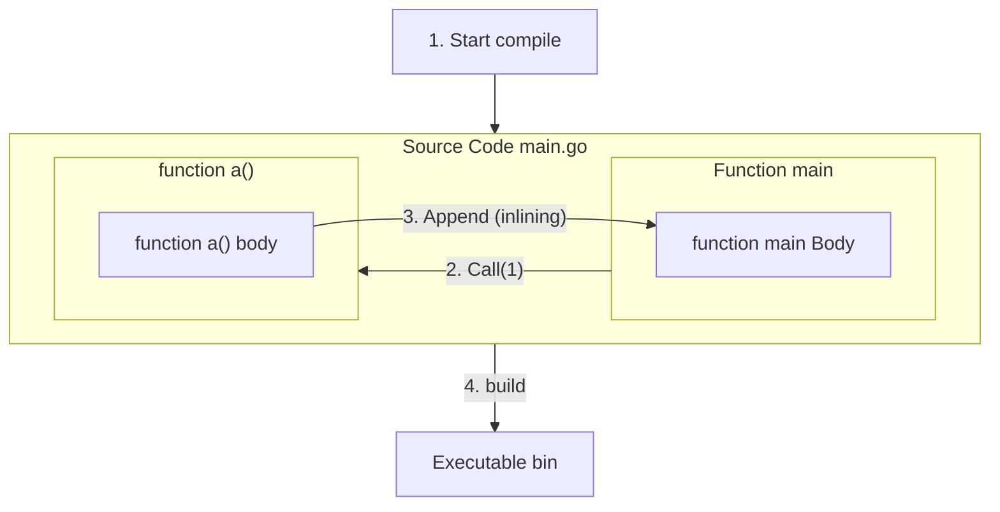

In the quest for efficient code, Go's compiler employs a powerful technique called function inlining.

## Unveiling the Mechanism

- Function Identification: The compiler scans your code, identifying functions suitable for inlining. It prioritizes smaller, frequently called functions with simple bodies.

- Eliminating Overhead: Instead of generating a separate function call, the compiler replaces the call with the function's code, removing the overhead of:
  - Jumping to a different memory location
  - Passing arguments
  - Returning results
- Code Integration: The inlined function's code is seamlessly integrated into the caller's code, creating a single, streamlined block.

## Advantages of Inlining

- Performance Boost:
  - Reduced function call overhead
  - Enhanced optimization opportunities
- Code Size Reduction: Elimination of redundant code in some cases
- Improved Cache Utilization: Better spatial locality of code and data


## Example

```go
func add(x, y int) int {
    return x + y
}

func main() {
    result := add(5, 3) // Function call
    // ...
}
```
After inlining:

```go
func main() {
    result := 5 + 3 // Inlined code
    // ...
}
```
## The Go Compiler's Inlining Decisions

- Function Size: Small, focused functions are more likely to be inlined.
- Call Frequency: Frequently called functions are prime candidates.
- Loop Presence: Functions containing loops are less likely to be inlined.
- Closures and Recursion: These complexities can hinder inlining.

## Key Considerations

- Over-inlining: This can lead to larger code size and potential cache misses.
- Readability: Excessive inlining can impact code clarity.
- Benchmarking: Measure performance gains to ensure effectiveness.
## Conclusion

Function inlining is a potent optimization tool in Go, but its judicious application is crucial. Understanding its mechanics and trade-offs empowers you to write efficient and maintainable Go code. By carefully considering function design, profiling performance, and leveraging compiler hints when necessary, you can effectively harness the power of inlining for optimal code execution.