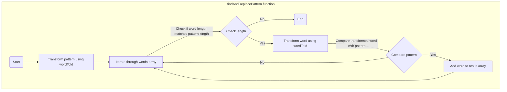

> Try to solve the solution before read this article at: [leetcode.com/problems/find-and-replace-pattern](https://leetcode.com/problems/find-and-replace-pattern)

# Intuition
<!-- Describe your first thoughts on how to solve this problem. -->
**Thoughts**:
- Focus on matching patterns, not exact characters. The problem doesn't require matching exact characters, but rather identifying words that follow the same pattern as the given pattern string.
- Character consistency is crucial. A word matches the pattern if we can consistently replace each character in the pattern with a unique character in the word, and vice versa.


# Approach
<!-- Describe your approach to solving the problem. -->
1.  Transform Words and Pattern:

    -   Create a function `wordToId` that transforms a word into a pattern-like string:
        -   It assigns a unique integer ID to each distinct character in the word.
        -   It joins these IDs using hyphens to create a pattern-like representation.
    -   Apply `wordToId` to both the `pattern` and each word in the `words` array.
2.  Identify Matching Words:

    -   Iterate through each word in the `words` array.
    -   If the transformed pattern-like string of the word matches the transformed `pattern`, add the original word to the `result` array.
3.  Return Matching Words:

    -   Return the `result` array containing the words that match the pattern.

# Complexity
-   Time complexity: O(n * m), where n is the number of words in the `words` array and m is the length of each word (and the `pattern`). This is due to iterating through each word and transforming it character by character.
-   Space complexity: O(m), where m is the length of the words and pattern. The space used is primarily for the hash map in `wordToId` and the transformed strings.

# Flow


# Code
## TypeScript
```typescript
function findAndReplacePattern(words: string[], pattern: string): string[] {
  const result: string[] = [];
  const wordToId = ((w: string) => {
    const idGetter = {
      hMap: {} as Record<string, number>,
      id: 0,
      getId() {
        return ++this.id
      },
      reset() {
        this.id = 0
        this.hMap = {}
      }
    }
    return [...w].map(c => {
      if (idGetter.hMap[c]) {
        return idGetter.hMap[c]
      } else {
        idGetter.hMap[c] = idGetter.getId()
        return idGetter.hMap[c]
      }
    }).join('-')
  })
  const p = wordToId(pattern)
  words.forEach(w => {
    if (w.length !== pattern.length) return
    const id = wordToId(w) 
    if (p === id) {
      result.push(w)
    }
  })

  return result
};
```
## Golang
## Rust

```rust
use std::collections::HashMap;

impl Solution {
    pub fn find_and_replace_pattern(words: Vec<String>, pattern: String) -> Vec<String> {
        let mut result = Vec::new();

        fn hash_word(w: &str) -> String {
            let mut char_to_id = HashMap::new();
            let mut id = 0;
            w.chars().map(|c| {
                *char_to_id.entry(c).or_insert_with(|| { id += 1; id })
            }).map(|id| id.to_string()).collect::<Vec<_>>().join("-")
        }

        let p = hash_word(&pattern);

        for w in words.iter() {
            if w.len() != pattern.len() {
                continue;
            }
            if p == hash_word(w) {
                result.push(w.clone());
            }
        }

        result

    }
}
```

```golang
func findAndReplacePattern(words []string, pattern string) []string {
    result := make([]string, 0)
    hashWord := func(w string) string {
        hMap := map[rune]int{}
        id := 0
        hashed := make([]string, 0, len(w))
        for _, c := range w {
            if _, ok := hMap[c]; !ok {
                hMap[c] = id
                id++
            }
            hashed = append(hashed, strconv.Itoa(hMap[c]))
        }
        return strings.Join(hashed, "-")
    }
    p := hashWord(pattern)
    for _, w := range words {
        if len(w) != len(pattern) {
            continue
        }
        if p == hashWord(w) {
            result = append(result, w)
        }
    }
    return result
}
```
# Reference
The LeetCode submission: [TypeScript](https://leetcode.com/problems/find-and-replace-pattern/submissions/1133020282/),  [Rust](https://leetcode.com/submissions/detail/1133316594/),  [Golang](leetcode.com/submissions/detail/1133315776/).
