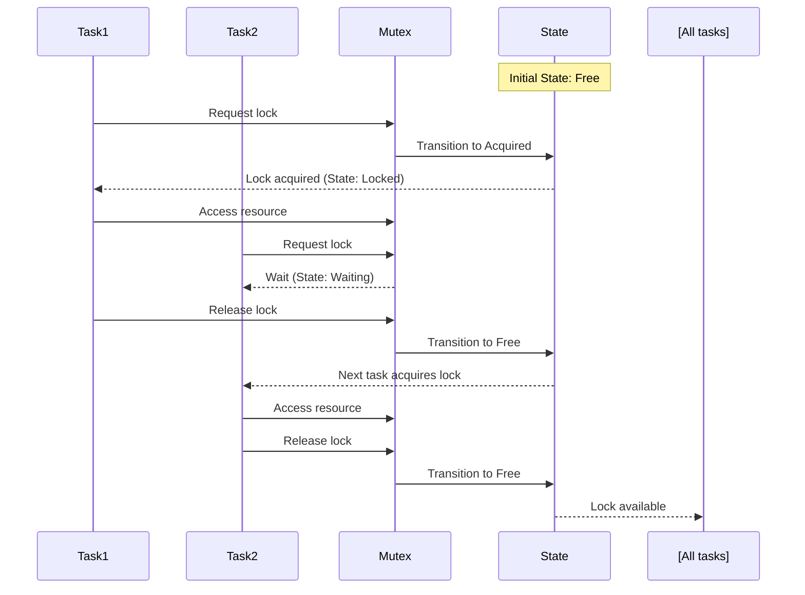
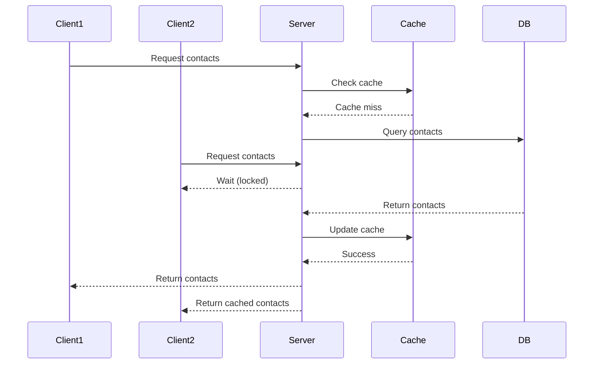
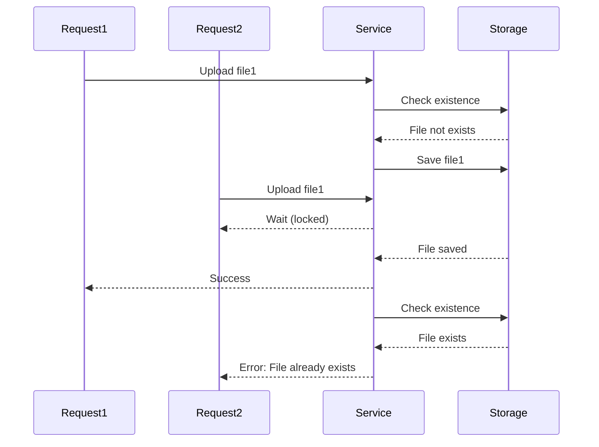

**TL;DR:** While mutexes are commonly associated with multi-threaded programming, they are also highly useful in Node.js, a single-threaded environment. They help coordinate access to shared resources and prevent redundant or conflicting operations, especially in scenarios like database queries or cache management.

---

## What Is a Mutex?

A **mutex** (short for **mutual exclusion**) is a mechanism that allows only one thread or process to access a critical section of code at a time. This ensures that shared resources are not simultaneously accessed or modified in ways that lead to conflicts or inconsistent states.

Under the hood, a mutex uses the following core concepts:

1. **State Management**:  
    The mutex maintains a state, typically a boolean flag (`locked`), indicating whether it is currently held by a process.
    
2. **Lock Acquisition**:  
    When a task attempts to acquire the lock, it checks the `locked` state:
    
    * If the lock is **unlocked**, the task acquires it and sets the state to `locked`.
        
    * If the lock is **already locked**, the task is queued for execution once the lock becomes available.
        
3. **Queue Management**:  
    Tasks that cannot acquire the lock immediately are added to a queue. The mutex processes this queue sequentially as the lock becomes available.
    
4. **Lock Release**:  
    Once the task holding the lock is completed, the lock is released by:
    
    * Setting `locked` to `false`.
        
    * Notifying the next task in the queue (if any) to acquire the lock.
        

This approach ensures that no two tasks can access the critical section simultaneously.

In Node.js, despite being single-threaded, mutexes can still play a crucial role. Why? Because Node.js applications can have asynchronous operations executing concurrently. These asynchronous tasks can lead to race conditions or redundant operations without proper coordination.



### Common Misconception

Many developers often associate mutexes with multi-threaded programming, but their utility extends far beyond that. In asynchronous environments like Node.js, where multiple operations may run concurrently, mutexes play a crucial role in managing access to shared resources. This helps prevent race conditions and redundant operations, ensuring that resources are accessed in a controlled and predictable manner.

As the saying goes,

> **“Concurrency is not parallelism”**

While Node.js operates on a single thread, it handles many asynchronous tasks concurrently. Mutexes help manage this concurrency by allowing only one task to access a critical section at a time, making it possible to safely coordinate access to shared resources, even in an environment where tasks run concurrently but not in parallel.

---

## Real-World Scenarios

Let’s explore two examples where mutexes prove invaluable in Node.js:

### 1\. Preventing Redundant Database Queries

Imagine a shared API endpoint that fetches a list of contacts. The database query takes 10 seconds to complete, and the result is cached for faster subsequent access. If 1,000 requests hit the endpoint during the query's execution, they could trigger 1,000 redundant database queries instead of waiting for the first query to complete.

#### Solution: Mutex-Based Cache Population

Here’s how you can use a mutex to ensure only one query runs:

```typescript
import { Injectable } from '@nestjs/common';
import { Cache } from 'cache-manager';
import { InjectCacheManager } from '@nestjs/cache-manager';
import { Mutex } from 'async-mutex';

@Injectable()
export class ContactsService {
  private readonly mutex = new Mutex();

  constructor(
    @InjectCacheManager() private cacheManager: Cache,
  ) {}

  async getContacts(): Promise<any[]> {
    const CACHE_KEY = 'contacts';

    // Check cache
    const cachedContacts = await this.cacheManager.get(CACHE_KEY);
    if (cachedContacts) {
      return cachedContacts as any[];
    }

    // Acquire mutex lock
    return this.mutex.runExclusive(async () => {
      // Double-check cache in case it was populated while waiting
      const doubleCheckCache = await this.cacheManager.get(CACHE_KEY);
      if (doubleCheckCache) {
        return doubleCheckCache as any[];
      }

      // Fetch data from database
      const contacts = await this.fetchContactsFromDb();

      // Store in cache
      await this.cacheManager.set(CACHE_KEY, contacts, { ttl: 60 });

      return contacts;
    });
  }

  private async fetchContactsFromDb(): Promise<any[]> {
    console.log('Querying database...');
    await new Promise((resolve) => setTimeout(resolve, 10000)); // Simulate 10s delay
    return [{ id: 1, name: 'John Doe' }, { id: 2, name: 'Jane Smith' }];
  }
}
```

#### Diagram (Mermaid):



---

### 2\. Coordinating File Uploads

Imagine a file upload service where users can upload files that are processed and stored in a cloud bucket. If multiple requests try to upload files with the same name simultaneously, they might overwrite each other’s data or create duplicates.

#### Solution: Mutex-Based File Upload Coordination

```typescript
import { Mutex } from 'async-mutex';

class FileUploadService {
  private readonly mutex = new Mutex();

  async uploadFile(fileName: string, fileContent: Buffer): Promise<void> {
    await this.mutex.runExclusive(async () => {
      if (await this.fileExists(fileName)) {
        throw new Error('File already exists');
      }

      await this.saveFile(fileName, fileContent);
    });
  }

  private async fileExists(fileName: string): Promise<boolean> {
    // Check if file exists in storage
    console.log(`Checking existence for ${fileName}`);
    await new Promise((resolve) => setTimeout(resolve, 100));
    return false; // Simulate no file exists
  }

  private async saveFile(fileName: string, fileContent: Buffer): Promise<void> {
    console.log(`Saving file: ${fileName}`);
    await new Promise((resolve) => setTimeout(resolve, 500));
  }
}
```

#### Diagram (Mermaid):



---

## Why Use Mutex in Node.js?

1. **Prevent Redundancy:** Avoid executing the same expensive operation multiple times.
    
2. **Ensure Consistency:** Protect shared resources from conflicting updates.
    
3. **Simplify Asynchronous Coordination:** Manage race conditions cleanly and predictably.
    

---

## **Alternative solutions**

While mutexes are effective for managing concurrency in Node.js, they are not the only solution. Depending on your use case, there are several **alternative solutions** for handling concurrency and shared resource management in Node.js. Here are some alternatives:

### 1\. **Locks with Redis (Distributed Locking)**

If you're working in a distributed environment or need to scale across multiple processes or machines, Redis can be used to create distributed locks. Redis provides a lightweight and highly performant solution to implement locks via the **SETNX** command (set if not exists) or libraries like **Redlock**.

#### Use Case:

* Distributed systems with multiple instances of Node.js servers needing synchronized access to resources.
    

#### Code Example:

```typescript
import { createClient } from 'redis';
import Redlock from 'redlock';

const client = createClient();
const redlock = new Redlock([client]);

async function fetchContactsWithRedisLock() {
  const resource = 'contacts-lock';
  try {
    const lock = await redlock.lock(resource, 10000); // 10 seconds
    const contacts = await fetchContactsFromDb();
    // Do something with the contacts...
    lock.unlock();
  } catch (error) {
    console.error('Could not acquire lock', error);
  }
}
```

### 2\. **Semaphore (Rate Limiting)**

A **semaphore** is another synchronization primitive that controls access to a particular resource by multiple processes in a concurrent system. A semaphore keeps track of how many "tokens" are available for tasks to acquire. Semaphore-based solutions are especially useful for rate-limiting access to a resource.

#### Use Case:

* Rate-limiting for APIs or services to ensure only a certain number of concurrent users can access a resource.
    

#### Code Example:

```typescript
import { Semaphore } from 'semaphore-async-await';

const semaphore = new Semaphore(1); // Allow only one concurrent access

async function fetchContactsWithSemaphore() {
  const resource = await semaphore.acquire();
  try {
    const contacts = await fetchContactsFromDb();
    return contacts;
  } finally {
    semaphore.release(resource);
  }
}
```

### 3\. **Event Emitters for Task Coordination**

For simpler concurrency management within a single process, you can use **Node.js EventEmitters** to notify other tasks when an operation is complete. While not a strict locking mechanism, EventEmitters allow you to manage the flow of asynchronous tasks and coordinate operations.

#### Use Case:

* When multiple tasks depend on the completion of a single task and need to avoid redundant execution.
    

#### Code Example:

```typescript
import { EventEmitter } from 'events';

const eventEmitter = new EventEmitter();

function fetchContactsAndNotify() {
  fetchContactsFromDb()
    .then(contacts => {
      eventEmitter.emit('contacts-fetched', contacts);
    });
}

function handleFetchedContacts() {
  eventEmitter.once('contacts-fetched', (contacts) => {
    console.log('Received contacts:', contacts);
  });
}

handleFetchedContacts();
fetchContactsAndNotify();
```

### 4\. **Worker Queues (e.g., Bull or Kue)**

Using **worker queues** like **Bull** or **Kue** can help with managing task concurrency in Node.js. These libraries allow you to create jobs that can be processed by worker processes, controlling concurrency and ensuring that resources are accessed in an orderly manner.

#### Use Case:

* Managing task queues where only a certain number of workers can access a resource at any given time.
    

#### Code Example with Bull:

```typescript
import { Queue, Worker } from 'bullmq';

const queue = new Queue('fetch-contacts');
const worker = new Worker('fetch-contacts', async job => {
  const contacts = await fetchContactsFromDb();
  // Process contacts...
}, {
  limiter: {
    groupKey: 'fetch-contacts',
    max: 1, // Only allow 1 worker at a time
    duration: 1000 // Limit requests per second
  }
});
```

### 5\. **Promise-based Locks**

In a simpler case, you can create a **promise-based lock** where the `lock` is a promise that other tasks can wait on before proceeding. This approach is helpful for managing a shared resource in single-threaded environments like Node.js.

#### Use Case:

* Managing access to a critical section of code with minimal complexity.
    

#### Code Example:

```typescript
class PromiseLock {
  private lock: Promise<void> = Promise.resolve();

  acquire() {
    let release: () => void;
    const newLock = new Promise<void>(resolve => release = resolve);
    const currentLock = this.lock;
    this.lock = this.lock.then(() => newLock);
    return currentLock.then(() => release);
  }
}

const lock = new PromiseLock();

async function fetchContacts() {
  const release = await lock.acquire();
  try {
    const contacts = await fetchContactsFromDb();
    return contacts;
  } finally {
    release();
  }
}
```

### 6\. **Single Responsibility Pattern with a Task Queue**

Sometimes, a simpler design pattern can solve concurrency challenges. You could use a **task queue** that ensures only one task accesses a shared resource at any given time by using a **single-responsibility** approach for managing a shared state.

#### Use Case:

* Preventing race conditions by ensuring one task processes data at a time.
    

#### Code Example:

```typescript
class TaskQueue {
  private queue: (() => void)[] = [];
  private isProcessing = false;

  enqueue(task: () => void) {
    this.queue.push(task);
    this.processQueue();
  }

  async processQueue() {
    if (this.isProcessing || this.queue.length === 0) return;
    this.isProcessing = true;
    const task = this.queue.shift();
    await task();
    this.isProcessing = false;
    this.processQueue();
  }
}

const taskQueue = new TaskQueue();

taskQueue.enqueue(async () => {
  const contacts = await fetchContactsFromDb();
  console.log(contacts);
});
```

---

### Comparison of Alternatives

| **Approach** | **Best For** | **Concurrency Level** | **Complexity** |
| --- | --- | --- | --- |
| **Mutex (async-mutex)** | Single-node concurrency control | High (single thread) | Moderate |
| **Redis Lock** | Distributed systems or microservices | High (across machines) | High |
| **Semaphore** | Rate limiting, controlling the number of concurrent tasks | Medium | Low |
| **Event Emitters** | Task coordination in single-process systems | Medium | Low |
| **Worker Queues (Bull)** | Task queues with concurrency control | High | High |
| **Promise-based Locks** | Simple concurrency management in single-threaded systems | Low (single thread) | Low |
| **Task Queue (SRP)** | Sequential task processing with minimal concurrency | Low | Low |

---

## Conclusion

While **mutexes** are an effective solution for managing shared resources in Node.js, you should consider these alternatives based on your specific needs:

* **Redis locks** or **distributed locks** are great for large-scale, distributed systems.
    
* **Semaphores** are useful for rate-limiting and managing controlled concurrency.
    
* **Promise-based locks** or **task queues** offer lightweight solutions for simpler scenarios.
    

Mutexes aren’t just for multi-threaded programming. In a single-threaded, asynchronous environment like Node.js, they provide a powerful tool for managing shared resources, ensuring consistent behavior, and optimizing performance. By adopting mutexes in scenarios like cache management and file uploads, you can make your applications more robust and efficient.

Give mutexes a try in your Node.js projects and see how they simplify concurrency challenges.