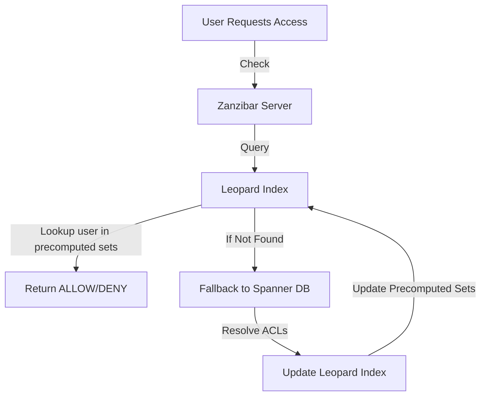
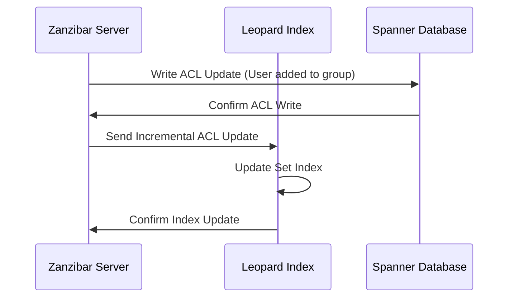

### **What is** **Leopard?**

> The leopard is one of the five extant cat species in the genus Panthera. It has a pale yellowish to dark golden fur with dark spots grouped in rosettes. Its body is slender and muscular reaching a length of 92–183 cm with a 66–102 cm long tail and a shoulder height of 60–70 cm. [Wikipedia](https://en.wikipedia.org/wiki/Leopard) #jf4 #bigcatvibes 🐾 =))))  
> Reference: [https://instagram.com/gauxinhtuoicuaba](https://instagram.com/gauxinhtuoicuaba) 🐆

### **What is** **Leopard Indexing?**

TL:DR;

> Leopard Indexing is the Zanzibar world’s version of a supercharged Bear 🐻‍❄️ 🏎️💨—except instead of running fast, it makes access control checks ridiculously quick.

**Leopard is basically a precomputed indexing system**. It is used in Zanzibar and authorization checks. Leopard Index efficiently handles deeply nested and wide **Access-Control-List** (**ACL**) relationships. It is primarily used for group-based permissions where users belong to hierarchical structures such as teams, roles, and shared access groups.

**Why is it needed?**

* **Standard recursion-based ACL checks are slow** when a group has **deep nesting** (e.g., `Org → Department → Team → User`).
    
* **Querying the database for every ACL lookup** leads to **high latency and database overload**.
    
* Leopard **precomputes** relationships, **flattening** nested permissions into **efficient set lookups**, reducing **authorization time to O(1) instead of O(n)**.
    

---

## **How it Works**

### **Key <s>Concepts</s> ingredients to cook this speed-boosting-system**

1. **Precomputed ACL Graphs**: Converts **nested ACLs** into **direct mappings**.
    
2. **Set-Based Lookups**: Uses **skip lists** and **optimized data structures** for **fast union & intersection operations**.
    
3. **Incremental Updates**: Updates index **in real-time** as ACLs change.
    

### **Example: Organization Hierarchy**

* Suppose we have **this ACL structure**:
    

```plaintext
Company → Department → Team → User
```

* Instead of **traversing relationships at runtime**, Leopard **precomputes flattened sets**:
    

```plaintext
Leopard Index:
    company:acme → { user:123, user:456, user:789 }
    department:engineering → { user:123, user:456 }
    team:frontend → { user:123 }
```

✅ **Now, checking if** `user:123` belongs to `company:acme` is an O(1) lookup.

---

## **How it Optimizes Checks**

### **Step 1: Flatten ACL Relationships**

Instead of evaluating **nested groups recursively**, Leopard **precomputes all relationships**.

#### **Before Leopard (Recursive Lookups)**

```plaintext
1. Check user:123 in team:frontend ❌
2. Check team:frontend in department:engineering ❌
3. Check department:engineering in company:acme ✅ (User is found)
```

* **Slow O(n) performance**
    
* **Each check requires a DB lookup**
    

#### **With Leopard (O(1) Lookup))**

```plaintext
company:acme → { user:123, user:456, user:789 }
```

* **Single lookup in precomputed index**
    
* **Blazing fast O(1) check** ✅
    

---

## **Architecture**

### Diagram of Gấu’s **Architecture**


(Ops, wrong diagram, nvm =)))

### Leopard Index:



✅ **Fastest path:** **Leopard returns decision instantly**.  
✅ **Fallback path:** If data is missing, it queries Spanner **once**, then updates Leopard.

---

## **Storing Data**

### **Leopard uses an efficient set representation:**

```plaintext
(T, S, E)
```

| **Field** | **Description** |
| --- | --- |
| `T` | **Set Type** (GROUP2GROUP, MEMBER2GROUP) |
| `S` | **Set ID** (e.g., `team:frontend`) |
| `E` | **Element ID** (e.g., `user:123`) |

### **Example: Flattened ACL Data**

```plaintext
GROUP2GROUP(team:frontend) → department:engineering
GROUP2GROUP(department:engineering) → company:acme
MEMBER2GROUP(user:123) → team:frontend
```

Now, **checking** `user:123` access to `company:acme` is just:

```plaintext
MEMBER2GROUP(user:123) ∩ GROUP2GROUP(company:acme) ≠ ∅
```

✅ **Set intersection is extremely fast** compared to recursive lookups.

---

## **How it is Updated in** [***near\[Real-Time\]***](https://en.wikipedia.org/wiki/Real-time_computing)

### **Incremental Indexing (No Painful Rebuilds!)**

* 🟢 Zanzibar uses a **real-time event stream** from its **Watch API**.
    
* 🟢 When ACLs **change**, Leopard **updates only affected sets** instead of **rebuilding everything** (thankfully!).
    



✅ **Only modified sets are updated, keeping operations fast.**

---

## **Leopard vs. Traditional Lookups**

| **Feature** | **Traditional lookups**(🥲) | **Leopard Index**(😎) |
| --- | --- | --- |
| **Check Complexity** | **O(n) recursive queries** | **O(1) direct lookup** |
| **Performance** | Slow for large groups | Scales to millions of ACLs |
| **Data Updates** | Requires full recomputation | **Incremental updates** |
| **Storage** | Normalized ACLs | **Precomputed flattened sets** |

📌 **Leopard makes group-based access checks 1000x faster** 🚀.

---

## **Why You Should Care About** [**Gấu**](https://instagram.com/gauxinhtuoicuaba) **🧐**

✅ **O(1) Lookup Performance** → No more waiting for slow queries.  
✅ **Precomputed Set Relationships** → ACL checks in milliseconds.  
✅ **Incremental Updates** → Never rebuilds everything from scratch.  
✅ **Cache-Friendly** → Avoids repeated DB hits, making things **blazing fast**.

---

### **📌 Key Takeaway**

Leopard is a **…** *nah, too long*.

> Wait, O(1)? That’s not just fast—that’s teleportatio*n 😉!*

c⁽¹⁾": cutesy: *adjective -* cute to a [sentimental](https://www.google.com/search?sca_esv=a84006a3a0467662&sxsrf=AHTn8zpSvaqJ1Y-5OonTbhv1pYrFz4J2Uw:1742226643083&q=sentimental&si=APYL9btEN2SiQ9h4o5Ckf6vYFXRYHo0QI9tiJJeEv0_15K7bldjbzhZc5LvvH7gx2k-PNKSrorZ5SR406mHgtumLxrtksOPW3DweuqDhN1nc-V_yNQcPCWs%3D&expnd=1&sa=X&ved=2ahUKEwicjreBvJGMAxU3XGwGHfL-EYkQyecJegQIRxAQ) or [mawkish](https://www.google.com/search?sca_esv=a84006a3a0467662&sxsrf=AHTn8zpSvaqJ1Y-5OonTbhv1pYrFz4J2Uw:1742226643083&q=mawkish&si=APYL9btezPaTUY7KecSEHRUsL7ycFrZX9Mncqu816dmJQGFWN7SFe_-M8KNKW-LXWS_95DJPLHVb3BuSTcbA4-riTgowUT6A6KKymYUU9DDuP02nmnJfQDQ%3D&expnd=1&sa=X&ved=2ahUKEwicjreBvJGMAxU3XGwGHfL-EYkQyecJegQIRxAR) extent. e.g. "hair pulled back in cutesy little bows"