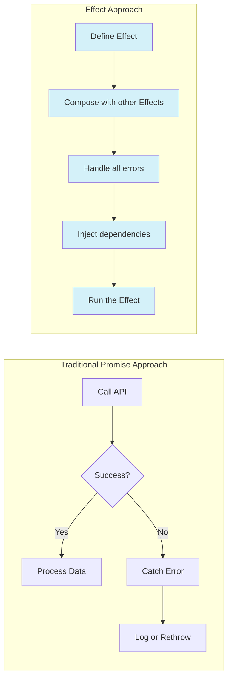
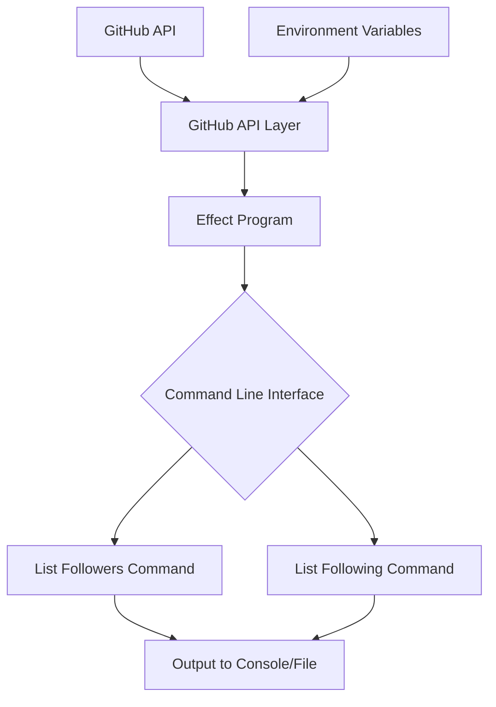
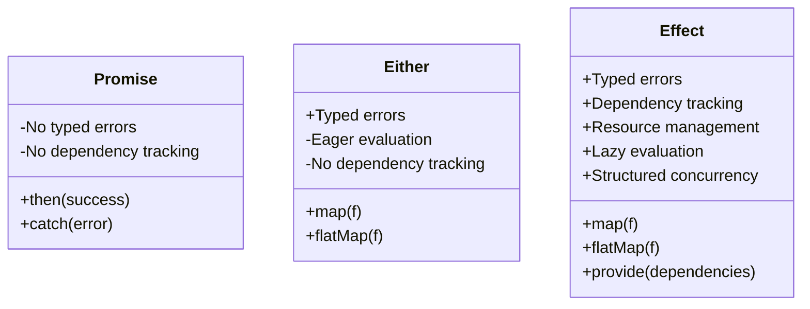
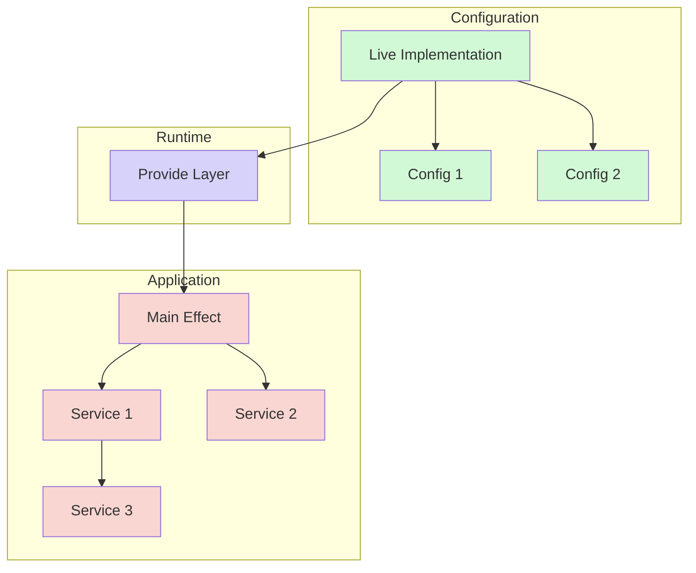
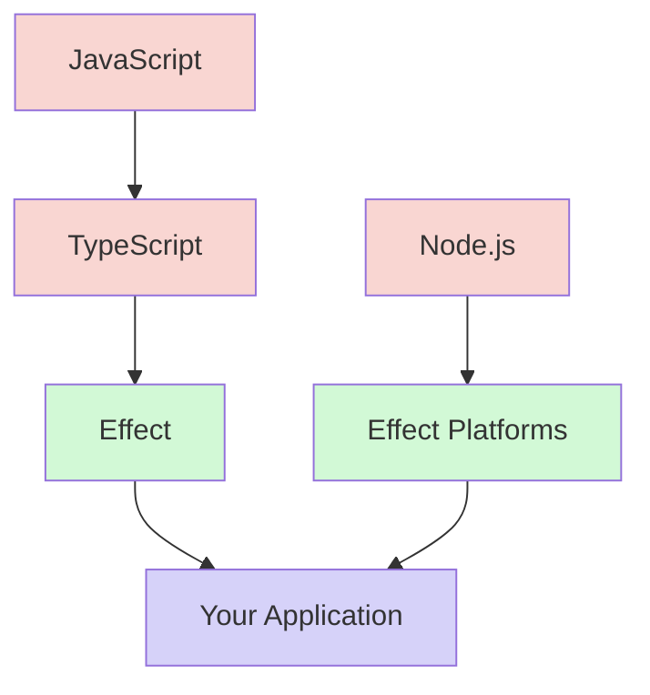

I've been working with TypeScript for years, and I've always been seeking better ways to handle side effects, errors, and dependencies. When I discovered Effect, it changed my approach to functional programming completely.

## What Effect Really Is

[Effect](https://effect.website/) isn't just another TypeScript library. As Ethan Niser explains in his [insightful article](https://ethanniser.dev/blog/the-truth-about-effect/):

> **Effect is a language.**
> 
> Specifically, Effect is an attempt to answer a question that many people have asked, and a few have answered: what would it look like if we had a language for describing effectful computations?

This realization hit me when I was reimagining a GitHub followers tracking tool. Effect isn't merely a collection of utility functions—it's a comprehensive approach to handling effectful computations within TypeScript.

What makes Effect special is how it extends existing tools:

- It extends `Promise` by making laziness, error handling, retries, interruption, and observability first-class citizens
- It extends TypeScript by adding typed errors, typed dependency injection, and structured concurrency
- It provides a rich standard library while making effects a language primitive

Let me show you the contrast between traditional Promise approaches and Effect:



With traditional Promises, error handling is bolted on with `.catch()`. With Effect, errors are part of the type signature itself - you simply can't forget to handle them.

## The Tradeoffs of Effect

Before diving into my implementation, I should note that Effect isn't without its tradeoffs:

1. **Learning curve** - Despite being more approachable than pure FP libraries, there's still a learning curve, especially for teams unfamiliar with functional concepts
2. **Bundle size** - At 14KB minified+gzipped (core), it's lightweight but not free
3. **Ecosystem maturity** - While growing rapidly, the ecosystem isn't as extensive as more established libraries
4. **Debug experience** - Stack traces can sometimes be harder to interpret due to the generator-based implementation

Despite these considerations, for many applications, the benefits significantly outweigh these costs.

## Play with Effect

To test these ideas of this new programming language, I took an existing tool—[GitHub Followers Watch](https://github.com/tuananh/github-followers-watch) originally written in Go—and reimplemented it as [GitHub Watcher](https://github.com/lyluongthien/github-watcher) using TypeScript and Effect.

The original tool's purpose was simple: track GitHub followers and following lists to monitor changes over time. But rebuilding it with Effect demonstrated some powerful concepts:



### Typed Errors: No More Try/Catch Chaos

```typescript
export class GitHubApiError extends Error {
  readonly _tag = "GitHubApiError";
  constructor(message: string) {
    super(message);
    this.name = "GitHubApiError";
  }
}
```

This isn't just error handling—it's precise, typed error handling that lets you know exactly what can fail at compile time.

### Describing Effects With Types

```typescript
interface GitHubApi {
  readonly getSelfID: Effect.Effect<string, GitHubApiError>;
  readonly listAllFollowing: (username: string) => Effect.Effect<string[], GitHubApiError>;
  readonly listAllFollowers: (username: string) => Effect.Effect<string[], GitHubApiError>;
}
```

Look at that interface. The return type tells you everything: what the success value is, what can go wrong, and what dependencies it has—all in one unified type.

Here's how Effect's type signature compares to other approaches:



### Generator-Based Composition: Readable Async Code

```typescript
export const printFollowers = Effect.gen(function* (_) {
  const api = yield* _(Effect.map(GitHubApiLive, layer => layer.GitHubApi));
  const login = yield* _(api.getSelfID);
  const followers = yield* _(api.listAllFollowers(login));
  return yield* _(Console.log(`${followers.join("\n")}`));
});
```

This is where Effect shines. The generator syntax makes asynchronous code read like synchronous code, but without losing precise error handling or types.

### Dependency Injection Without the Framework

```typescript
export const GitHubApiLive = Effect.gen(function* (_) {
  const token = yield* _(Effect.try({
    try: () => {
      const token = process.env.PERSONAL_ACCESS_TOKEN;
      if (!token) throw new Error("PERSONAL_ACCESS_TOKEN env var not set");
      return token;
    },
    catch: () => new GitHubApiError("PERSONAL_ACCESS_TOKEN env var not set")
  }));

  const octokit = new Octokit({ auth: token });
  return makeGitHubApi(octokit);
}).pipe(Effect.map(api => ({ GitHubApi: api })));
```

Dependencies are handled through layers, not some complicated DI container. It's just values all the way down.

Here's a visualization of Effect's dependency injection approach:



## Testing: The Killer Feature

The biggest "aha" moment came when testing. With `@effect/vitest`, testing effectful code becomes almost trivial:

```typescript
it.effect("fetches and prints followers", () =>
  Effect.gen(function* (_) {
    const consoleLogSpy = vi.spyOn(console, "log").mockImplementation(() => {})
    
    console.log(mockFollowers.join("\n"))
    
    try {
      assert.strictEqual(consoleLogSpy.mock.calls.length, 1)
      assert.strictEqual(consoleLogSpy.mock.calls[0][0], mockFollowers.join("\n"))
    } finally {
      consoleLogSpy.mockRestore()
    }
  })
)
```

## When Not to Use Effect

While I'm enthusiastic about Effect, it's not the right solution for every problem:

1. **Small, simple utilities** - For tiny scripts or utilities, Effect might be overkill
2. **Performance-critical hot paths** - For code that needs absolute maximum performance, the abstractions might introduce overhead
3. **Teams unfamiliar with FP** - If your team has no experience with functional concepts, the learning curve might outweigh the benefits initially
4. **Very small microservices** - For extremely focused microservices, the complexity might not be justified

## The Revelation

Here's what I've realized: Effect isn't trying to replace TypeScript or make you learn a completely new language. It's extending what you already know by making effectful computations a first-class concept.

You don't need to discard your years of experience with JavaScript, TypeScript, and Node. Effect builds on them by using standard language features:

- Generators for composition
- TypeScript's type system for tracking success, errors, and dependencies
- An ecosystem of modules that work together seamlessly

This is what Ethan meant when he called Effect a language—it's a way of expressing computations within TypeScript that gives you superpowers without forcing you to abandon your existing knowledge.



## Try It Yourself

Whether you're building a tiny utility or a complex application, Effect provides a functional approach without the learning curve normally associated with purely functional languages.

Give it a try in your next project. You might find yourself thinking of TypeScript in a completely different way—I know I did.

## Resources

- [Effect Official Website](https://effect.website/)
- [GitHub Watcher](https://github.com/lyluongthien/github-watcher)
- [The Truth About Effect by Ethan Niser](https://ethanniser.dev/blog/the-truth-about-effect/)
