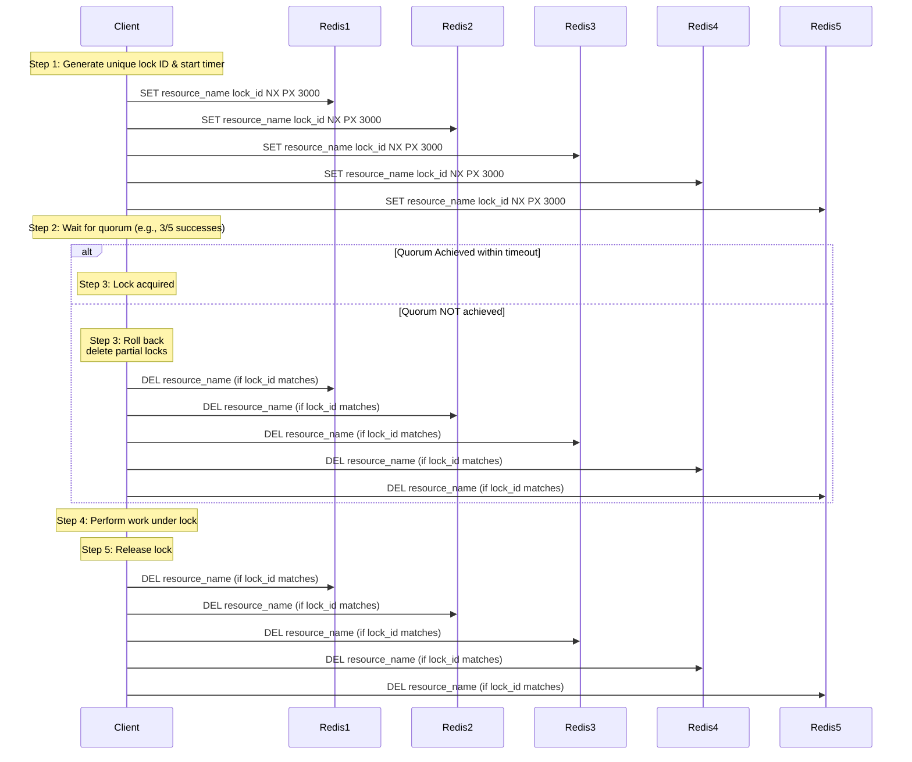

 
The Redlock algorithm is a distributed locking mechanism designed for Redis to ensure mutual exclusion across clients in a distributed system. It operates by acquiring locks on a majority of Redis nodes to guard against node failures and network partitions. Despite its popularity, Redlock has sparked debate regarding its safety guarantees and implementation complexity.

## Distributed locks

Distributed locks are crucial for coordinating access to shared resources in distributed applications. Traditional locking mechanisms often rely on a central coordinator, which can become a single point of failure. Redlock offers a decentralized approach by leveraging multiple independent Redis instances.

## How Redlock Works

To acquire a lock, a client generates a unique token and sends a `SET key value NX PX ttl` command to each of the N Redis instances. The client considers the lock acquired only if it successfully locks a majority (quorum) of the instances. The total time to acquire the lock must be less than the TTL specified to prevent expired locks from being mistaken as held. When the client completes its critical section, it releases the lock by sending a `DEL key` command to all instances—but only if the stored token matches—to prevent releasing someone else’s lock.

## Algorithm

1. **Acquire**: The client tries to acquire the lock on each instance sequentially with a unique identifier and expiration time.  
2. **Validate**: It computes the elapsed time and verifies if the quorum was achieved within the TTL to ensure lock validity.  
3. **Commit/Abort**: If the quorum is met and the timing constraints hold, the client holds the lock; otherwise, it rolls back by deleting partial locks from the instances.

## It seems like with Two‑Phase Commit?

Redlock resembles a two‑phase commit in that it performs a prepare phase (acquiring locks) followed by a commit or abort (keeping or releasing locks) based on quorum success. Unlike traditional 2PC, Redlock does not rely on a central coordinator and can tolerate some instance failures without blocking the system.

## Pros and Cons

**Pros**  
- Provides fault tolerance by ensuring locks remain valid even if some Redis nodes fail.  
- Uses TTLs to prevent deadlocks by automatically expiring locks if clients crash before releasing them.  

**Cons**  
- Requires careful coordination of multiple Redis instances, increasing operational complexity.  
- May not guarantee mutual exclusion under certain failure scenarios, like network partitions during replication.

## Best Practices

Operators should deploy an odd number of independent Redis masters with synchronized clocks to minimize TTL drift. Clients should handle lock acquisition failures gracefully by implementing retry logic with exponential backoff to avoid thundering herd problems.

## Implementations
According to [redis](https://redis.io/docs/latest/develop/use/patterns/distributed-locks/):

-   [Redlock-rb](https://github.com/antirez/redlock-rb) (Ruby implementation). There is also a [fork of Redlock-rb](https://github.com/leandromoreira/redlock-rb) that adds a gem for easy distribution.
-   [RedisQueuedLocks](https://github.com/0exp/redis_queued_locks) (Ruby implementation).
-   [Redlock-py](https://github.com/SPSCommerce/redlock-py) (Python implementation).
-   [Pottery](https://github.com/brainix/pottery#redlock) (Python implementation).
-   [Aioredlock](https://github.com/joanvila/aioredlock) (Asyncio Python implementation).
-   [RedisMutex](https://github.com/malkusch/lock#redismutex) (PHP implementation with both [Redis extension](https://github.com/phpredis/phpredis) and [Predis library](https://github.com/predis/predis) clients support).
-   [Redlock-php](https://github.com/ronnylt/redlock-php) (PHP implementation).
-   [cheprasov/php-redis-lock](https://github.com/cheprasov/php-redis-lock) (PHP library for locks).
-   [rtckit/react-redlock](https://github.com/rtckit/reactphp-redlock) (Async PHP implementation).
-   [Redsync](https://github.com/go-redsync/redsync) (Go implementation).
-   [Redisson](https://github.com/mrniko/redisson) (Java implementation).
-   [Redis::DistLock](https://github.com/sbertrang/redis-distlock) (Perl implementation).
-   [Redlock-cpp](https://github.com/jacket-code/redlock-cpp) (C++ implementation).
-   [Redis-plus-plus](https://github.com/sewenew/redis-plus-plus/#redlock) (C++ implementation).
-   [Redlock-cs](https://github.com/kidfashion/redlock-cs) (C#/.NET implementation).
-   [RedLock.net](https://github.com/samcook/RedLock.net) (C#/.NET implementation). Includes async and lock extension support.
-   [ScarletLock](https://github.com/psibernetic/scarletlock) (C# .NET implementation with configurable datastore).
-   [Redlock4Net](https://github.com/LiZhenNet/Redlock4Net) (C# .NET implementation).
-   [node-redlock](https://github.com/mike-marcacci/node-redlock) (NodeJS implementation). Includes support for lock extension.
-   [Deno DLM](https://github.com/oslabs-beta/Deno-Redlock) (Deno implementation)
-   [Rslock](https://github.com/hexcowboy/rslock) (Rust implementation). Includes async and lock extension support.

## Conclusion

Redlock remains a valuable tool for distributed locking in Redis when used with care and understanding of its trade‑offs. By following best practices and acknowledging its limitations, teams can leverage Redlock to maintain data consistency in distributed systems.

## References

1. [Distributed Locks with Redis | Redis Docs](https://redis.io/docs/latest/develop/use/patterns/distributed-locks/)  
2. [Redis Lock – Redlock Algorithm | Redis Glossary](https://redis.io/glossary/redis-lock/) 
3. [Distributed lock manager – Wikipedia](https://en.wikipedia.org/wiki/Distributed_lock_manager)  
